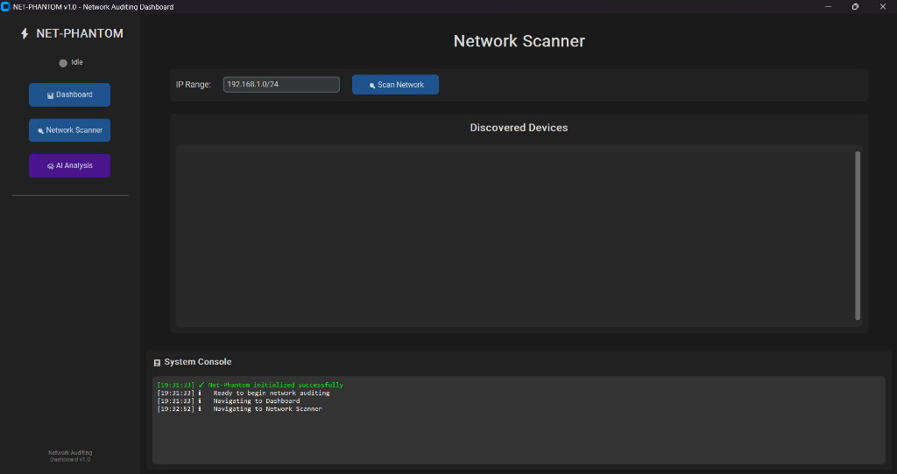
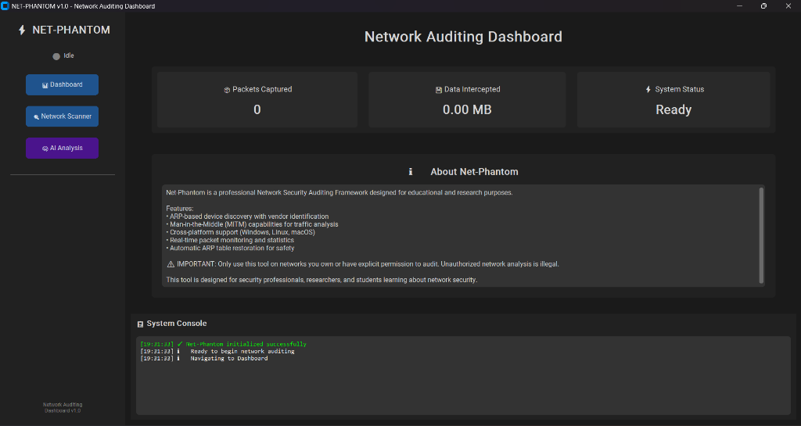

# NET-PHANTOM

**Network Security Auditing Dashboard with AI-Powered Traffic Analysis**


> **Warning:** For educational and authorized security research only. Unauthorized network analysis is illegal.

---

## Screenshots




---

## Features

| Feature | Description |
|---|---|
| Network Scanner | ARP-based device discovery with MAC vendor identification |
| MITM Attack | ARP spoofing for traffic interception |
| Packet Sniffer | Real-time capture filtered by target device IP |
| Kill Switch | Block internet access for targeted devices |
| AI Analysis | Behavioral analysis and user profiling via Llama 3 |
| Smart Filtering | Removes CDNs, ads, telemetry, and noise automatically |

---

## Installation

**Requirements:** Python 3.8+, Windows, [Ollama](https://ollama.ai) with Llama 3

```bash
git clone https://github.com/darama22/Net-Phantom.git
cd Net-Phantom
pip install -r requirements.txt
ollama pull llama3
```

**Run:**
```bash
# Double-click launch.bat  (auto-requests admin privileges)
```

---

## Usage

1. **Scan** — Enter IP range (e.g. `192.168.1.0/24`) and click Scan Network
2. **MITM** — Select a device and click Start MITM
3. **Sniff** — Click Start Sniffer to capture traffic from the target device only
4. **Analyze** — Go to AI Analysis and click Analyze Traffic or Generate Profile

---

## Project Structure

```
Net-Phantom/
├── main.py
├── launch.bat
├── requirements.txt
├── core/
│   ├── ai_analyzer.py      # Llama 3 traffic analysis
│   ├── mitm.py             # ARP spoofing engine
│   ├── scanner.py          # Network discovery
│   ├── sniffer.py          # Packet capture
│   └── traffic_filter.py   # Noise filtering
└── gui/
    ├── app.py
    └── pages/
        ├── ai_page.py
        ├── dashboard.py
        └── scanner_page.py
```

---

## Tech Stack

- [Scapy](https://scapy.readthedocs.io/) — Packet manipulation
- [CustomTkinter](https://customtkinter.tomschimansky.com/) — GUI framework
- [Ollama](https://ollama.ai) — Local LLM inference (Llama 3)
- [mac-vendor-lookup](https://pypi.org/project/mac-vendor-lookup/) — Device identification

---

*Created as a portfolio project demonstrating network security and AI integration.*
